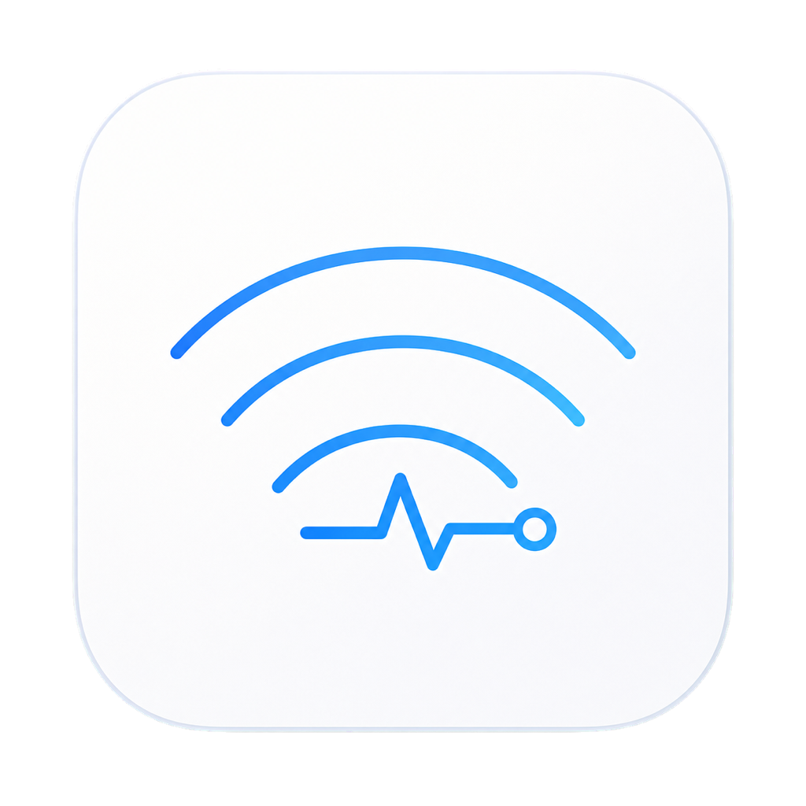

<p align="center">
  
</p>

<h1 align="center">Wi-Fi 体检台</h1>

<p align="center">
  一款面向普通用户的 macOS / Windows 桌面 Wi-Fi 诊断工具。<br>
  不只显示一堆参数，而是直接回答：<strong>慢在哪里、证据是什么、下一步怎么做。</strong>
</p>

<p align="center">
  <strong>当前统一版本 v0.4.1</strong>
  ·
  <a href="https://github.com/meyaomiao/wifi-health-console/releases/download/v0.4.1/Wi-Fi-Health-Console-0.4.1-universal.dmg">macOS 通用 DMG</a>
  ·
  <a href="https://github.com/meyaomiao/wifi-health-console/releases/download/v0.4.1/WiFi-Health-Console-Setup-x64.exe">Windows x64 EXE</a>
  ·
  <a href="https://github.com/meyaomiao/wifi-health-console/releases/download/v0.4.1/WiFi-Health-Console-Setup-arm64.exe">Windows ARM64 EXE</a>
  ·
  <a href="https://github.com/meyaomiao/wifi-health-console/releases/tag/v0.4.1">统一发布说明</a>
</p>

<p align="center">
  <a href="LICENSE">MIT 开源许可证</a>
  ·
  <a href="THIRD-PARTY-NOTICES.md">第三方许可声明</a>
  ·
  <a href="CODE_SIGNING_POLICY.md">Code signing policy / 代码签名政策</a>
</p>

> 自 v0.4.0 起，每个产品版本只使用一个版本号和一个跨平台 Release。v0.4.0 同时提供已签名、公证并装订票据的 macOS 通用 DMG，以及 Windows x64 / ARM64 EXE。两个平台都可直接用图形界面安装与使用，不需要命令行。

## 平台支持

| 平台 | 当前版本 | 界面与采集 | 发布状态 |
| --- | --- | --- | --- |
| macOS | v0.4.1 | SwiftUI + CoreWLAN / macOS 系统网络能力 | 正式版，已签名与 Apple 公证 |
| Windows | v0.4.1 Preview | Avalonia + Windows Native WLAN API | 预览版，提供 x64 / ARM64 安装器 |

Windows 版不是命令行工具。它使用与 macOS 版相近的深色侧边栏、指标卡、统一状态色、双曲线测速和完整信道雷达，并共享“**结论 → 证据 → 动作**”的信息结构。

## 为什么做这个工具

Wi-Fi 变慢时，最难的通常不是发现“它很慢”，而是判断问题究竟在哪一段：

- 是电脑离路由器太远，信号或信噪比不够？
- 是附近网络重叠，信道过于拥挤？
- 是电脑到路由器的局域网在丢包和抖动？
- 是宽带出口、DNS 或网站响应慢？
- 还是 VPN、代理改变了实际网络路径？

这个项目来自一次真实的家庭 Wi-Fi 排障。当时 5 GHz 网络工作在信道 40、160 MHz 频宽，路由器侧显示 CCA 长时间达到 90%～97%，同时出现大量重传。表面看信号并不差，但空口几乎一直被占用。把频宽调整为 80 MHz 后，稳定性和实际体验明显改善。

这次经历暴露了现有工具的共同问题：有的只给一个测速数字，有的堆满 RSSI、SNR、信道等术语，却没有告诉普通用户这些数字会影响什么、当前结果算好还是坏、应该先改哪里。

因此 Wi-Fi 体检台采用统一的“**结论 → 证据 → 动作**”结构，并把无线空口、局域网、宽带出口、VPN / 代理分开判断。你不需要先成为网络工程师，才能看懂一次 Wi-Fi 体检。

## 它有什么用

| 遇到的情况 | Wi-Fi 体检台如何帮助判断 |
| --- | --- |
| Wi-Fi 满格但网页、视频仍然慢 | 分开检查无线质量、网关、DNS、HTTPS 和公网响应，避免把所有问题都归咎于“信号” |
| 视频会议、游戏或远程桌面偶尔卡住 | 查看网关延迟、抖动和丢包，判断家庭内部链路是否稳定 |
| 附近 Wi-Fi 很多，不知道怎么选信道 | 用信道雷达总览 2.4 / 5 / 6 GHz 网络的信道与频宽重叠，并给出频段、频宽和候选信道建议 |
| 开启 VPN 或代理后感觉变慢 | 对比“当前实际链路”和“直连 Wi-Fi 基线”，帮助定位路径差异 |
| 改完路由器设置，不确定是否真的改善 | 保存历史采样，标记“变更前 / 变更后”并重新体检对比 |
| 不知道路由器管理地址 | 自动检测当前 Wi-Fi 的默认网关，不使用固定厂商 IP |

### 四层诊断，不把不同问题混在一起

| 层级 | 主要证据 | 回答的问题 |
| --- | --- | --- |
| 无线空口 | 频段、信道、频宽、RSSI、噪声、SNR、协商速率、附近网络重叠 | 当前电脑的无线连接是否太弱、受干扰或配置不合适 |
| 局域网 | 电脑到默认网关的延迟、抖动、丢包 | 问题是否发生在家庭内部，而不是运营商或网站 |
| 宽带出口 | DNS、HTTPS、公网延迟、下载和上传速度 | 路由器之外的互联网访问是否异常 |
| VPN / 代理 | 系统路径状态、当前链路与直连基线对比 | 日常使用的网络路径是否被 VPN 或代理影响 |

### 当前版本包含

- **当前概览**：显示 SSID、频段、信道、频宽、RSSI、噪声、SNR 和协商速率。每个指标卡片同时解释“它影响什么”“好坏标准是什么”“本次结果意味着什么”。
- **60 秒体检**：持续采样无线状态，并检测网关延迟 / 抖动 / 丢包、DNS、HTTPS 和公网延迟，最后按四层输出结论、证据和下一步动作。
- **网速测速**：下载与上传分阶段测量、分成两张实时平滑曲线展示；结果同时显示 Mbps 和 MB/s，不需要自己换算，并显示空闲延迟与负载响应能力。macOS 使用系统结果，Windows 使用测速期间的真实 HTTPS 往返探针。
- **两种测速链路**：“当前实际链路”最接近日常 App 的体验；“直连 Wi-Fi 基线”用于比较 VPN / 代理可能带来的影响。
- **两种测速时长**：标准模式下载、上传每方向各测约 20 秒；稳定模式各测约 30 秒，更适合热点、高波动链路和变更前后回测。延迟预检和连接建立另计，异常网络下总耗时会更长。
- **信道雷达**：用同一页三段式总览同时展示 2.4 / 5 / 6 GHz 可见网络的信道、频宽和重叠关系，也可切换单频段详情，并分别给出频段、20 / 40 / 80 / 160 MHz 频宽和候选信道建议。
- **历史趋势**：保存本机采样，查看 RSSI 与体检结果变化，并支持“变更前 / 变更后”标记。
- **路由管理**：自动检测当前网络的默认网关并打开候选管理页，不固定为 `192.168.31.1`，也不依赖小米、华为、TP-Link 等厂商预设。
- **macOS 菜单栏入口**：不打开主窗口也能快速开始体检、测速或扫描附近网络。

macOS 常用快捷键：`Command-R` 刷新、`Shift-Command-D` 开始体检、`Shift-Command-T` 开始测速、`Shift-Command-S` 扫描附近网络。

应用是只读工具，不会自动登录路由器，也不会修改信道、频宽、DNS 或其他网络设置。

## Windows Preview 下载与安装

### 系统要求

- Windows 10 / 11 64 位版本
- Intel / AMD 电脑下载 `x64`；只有 Windows on ARM 设备下载 `ARM64`

### 安装步骤

1. 普通 Intel / AMD Windows 电脑下载 [x64 EXE 安装器](https://github.com/meyaomiao/wifi-health-console/releases/download/v0.4.1/WiFi-Health-Console-Setup-x64.exe)；Windows on ARM 设备下载 [ARM64 EXE 安装器](https://github.com/meyaomiao/wifi-health-console/releases/download/v0.4.1/WiFi-Health-Console-Setup-arm64.exe)。
2. 双击下载好的 `.exe`，按安装向导完成安装。默认安装到当前用户的 `%LOCALAPPDATA%\Programs\WiFiHealthConsole`，不需要管理员权限。
3. 从开始菜单打开“Wi-Fi 体检台”。安装时也可勾选创建桌面快捷方式。

整个过程都是图形界面，**不需要打开 PowerShell、命令提示符或其他命令行工具**。

当前 v0.4.1 Windows Preview 安装器尚未进行 Authenticode 签名，SmartScreen 可能显示“Windows 已保护你的电脑”或“未知发布者”。请确认安装包来自本项目的官方 [v0.4.1 统一 Release](https://github.com/meyaomiao/wifi-health-console/releases/tag/v0.4.1)，并优先对照发布页中的 `SHA256SUMS.txt`。项目正在准备申请 SignPath Foundation 的免费开源代码签名服务，但尚未获批；当前安装器不能视为由 SignPath 签名。macOS 使用的 **Apple Developer ID Application** 证书只能签名 Apple 平台应用，不能用来签名 Windows `.exe`。详见[代码签名政策](CODE_SIGNING_POLICY.md)。

覆盖安装新版 EXE 即可升级。可在“设置 → 应用”中卸载；卸载默认保留 `%LOCALAPPDATA%\WiFiHealthConsole` 里的历史记录与设置。更多构建和安装器信息见 [Windows/README.md](Windows/README.md)。

## macOS 下载与安装

### 系统要求

- macOS 14 Sonoma 或更高版本
- Apple Silicon（M 系列）或 Intel Mac

### 安装步骤

1. 下载 [Wi-Fi 体检台 v0.4.1 通用安装包](https://github.com/meyaomiao/wifi-health-console/releases/download/v0.4.1/Wi-Fi-Health-Console-0.4.1-universal.dmg)。也可以进入 [统一 Release 页面](https://github.com/meyaomiao/wifi-health-console/releases/tag/v0.4.1) 查看全部平台安装包。
2. 双击下载好的 `Wi-Fi-Health-Console-0.4.1-universal.dmg`。
3. 在打开的安装窗口中，把“Wi-Fi 体检台”拖到旁边的“Applications / 应用程序”文件夹。
4. 推出安装镜像，然后从“启动台”或 Finder 的“应用程序”文件夹打开“Wi-Fi 体检台”。

正式版本已经过 Apple 签名和公证，正常情况下可以直接打开，**不需要输入命令，也不需要右键绕过安全检查**。

### 校验安装包（可选）

普通用户可以跳过这一步。如果需要确认下载文件完整，可在终端运行：

```sh
shasum -a 256 ~/Downloads/Wi-Fi-Health-Console-0.4.1-universal.dmg
```

正确值请对照 [v0.4.1 Release 中的统一 SHA256SUMS.txt](https://github.com/meyaomiao/wifi-health-console/releases/download/v0.4.1/SHA256SUMS.txt)。该文件同时列出 macOS、Windows x64 和 Windows ARM64 三个安装包。

## macOS 第一次使用

### 1. 连接要检查的 Wi-Fi

先让 Mac 连接到你实际想检查的网络。工具检测的是**当前这台 Mac 的 Wi-Fi 链路**。

### 2. 允许定位权限

在概览页点击“授权”，然后在 macOS 弹窗中选择允许。macOS 要求应用获得定位权限后，才能通过系统 Wi-Fi 接口读取当前 SSID / BSSID 并扫描附近网络。

Wi-Fi 体检台不会读取或保存位置坐标。即使不授权，网关、DNS、HTTPS、公网延迟和网速测速等不依赖 SSID 的功能仍可使用，但当前 Wi-Fi 名称和信道雷达会缺少必要信息。

如果以前点过“不允许”，macOS 通常不会再次显示授权弹窗：

1. 点击应用里的“打开系统设置”。
2. 进入“隐私与安全性 → 定位服务”。
3. 打开“Wi-Fi 体检台”的开关。
4. 回到应用点击“刷新”；如果信息仍未更新，完全退出后重新打开应用。

## 推荐使用流程

1. **先看“概览”**
   查看顶部健康结论，再看异常指标。每张卡片都会说明当前数值、状态、体验影响、判定标准和针对本次结果的解释。

2. **运行“60 秒体检”**
   等待完整采样结束。优先处理“严重”，其次处理“注意”；不要只看某一个数字，要结合无线、局域网、宽带出口和 VPN / 代理四层结论。

3. **运行“网速测速”**
   日常排查先选“当前实际链路”。如果正在使用 VPN / 代理，再测一次“直连 Wi-Fi 基线”进行比较。下载和上传会依次执行，并在两张独立曲线中实时绘制。直连基线会绑定 Wi-Fi 接口，但部分 VPN、网络扩展或企业网络仍可能接管或阻止这条路径。

4. **查看“信道雷达”**
   重新扫描附近网络，切换 2.4 / 5 / 6 GHz 查看完整频谱总览。重点观察当前网络和强信号邻居的频宽重叠，再阅读频段、频宽和信道建议。

5. **手动调整路由器**
   在“路由管理”中确认自动检测到的网关，打开管理页后再手动修改设置。工具不会替你保存或提交任何路由器配置。

6. **做变更前后回测**
   调整前先保存一轮体检并标记“变更前”；调整后在相同位置、相近时间重新体检并标记“变更后”，再到“历史趋势”比较。

## 怎么理解结果

所有页面使用同一套状态规则，卡片文字、颜色和总览结论来自同一个判定结果，避免出现“文字说正常，颜色却在报警”的矛盾。

| 状态 | 含义 | 建议 |
| --- | --- | --- |
| 优秀 | 明显优于常见家庭网络需求 | 通常不需要处理，可继续排查其他层 |
| 正常 | 在常见使用范围内 | 当前指标不是首要瓶颈 |
| 注意 | 已偏离正常范围，可能影响体验 | 根据卡片动作建议进一步确认或调整 |
| 严重 | 明显异常，容易造成卡顿、重传、掉线或失败 | 优先处理这一项，再做后续测速 |
| 参考 | 可用于理解环境，但不能单独判定故障 | 与其他证据一起看 |
| 未检测 | 系统没有提供数据、权限不足或测试未完成 | 按页面提示补充权限或重新测试 |

### 核心阈值

这些阈值用于家庭网络诊断和体验分级，不等同于运营商套餐验收标准。

| 指标 | 优秀 / 正常 | 注意 | 严重 |
| --- | --- | --- | --- |
| RSSI | `> -55 dBm` 优秀；`-55～-67 dBm` 正常 | `-68～-75 dBm` | `< -75 dBm` |
| SNR | `≥ 40 dB` 优秀；`30～39 dB` 正常 | `20～29 dB` | `< 20 dB` |
| 网关延迟 | `≤ 10 ms` 优秀；`> 10～30 ms` 正常 | `> 30～100 ms` | `> 100 ms` |
| 网关抖动 | `≤ 10 ms` | `> 10～30 ms` | `> 30 ms` |
| 网关丢包 | `≤ 1%` | `> 1～5%` | `> 5%` |
| CCA | `≤ 50%` | `> 50～80%` | `> 80%` |
| 公网延迟 | `≤ 80 ms` | `> 80～150 ms` | `> 150 ms` |
| 公网 ICMP 丢包 | `≤ 10%`，仅作正常参考 | `> 10%` | 不单独判为严重 |
| DNS | `≤ 100 ms` | `> 100～300 ms` | `> 300 ms` 或解析失败 |
| HTTPS | `≤ 800 ms` | `> 800～2000 ms` | `> 2000 ms` 或请求失败 |
| 下载速度 | `≥ 100 Mbps` 优秀；`25～99.9 Mbps` 正常 | `10～24.9 Mbps` | `< 10 Mbps` |
| 上传速度 | `≥ 20 Mbps` 优秀；`10～19.9 Mbps` 正常 | `5～9.9 Mbps` | `< 5 Mbps` |
| 空闲延迟 | `≤ 40 ms` | `> 40～100 ms` | `> 100 ms` |
| 负载响应能力 | `≥ 600 RPM` 优秀 | `200～599 RPM` | `< 200 RPM` |

补充说明：

- 公网服务器可能降低 ICMP 优先级，因此公网 ICMP 丢包只作为辅助证据，不会单独把总体结论判为“严重”。
- CCA 表示无线空口繁忙比例，但 macOS 公共 API 不提供路由器侧 CCA。本工具会明确显示“未检测”，不会用猜测值伪造结果；如路由器管理页能显示 CCA，可按上表辅助判断。
- 2.4 GHz 通常优先使用 20 MHz；5 / 6 GHz 的 80 MHz 通常更均衡；160 MHz 只有在频谱足够干净时才更合适。最终建议仍需结合附近网络、路由器 CCA、重传和实际回测。

## 网速测速说明

macOS 版使用系统 `networkQuality`，Windows 版使用独立的分阶段下载 / 上传测试。两个平台都会先测下载、再测上传，并在两张独立的平滑实时曲线中展示，不会把两个阶段混在同一条线上。结果同时显示 Mbps 和 MB/s，无需手动换算。Windows 版还会在下载和上传负载期间发送独立的 HTTPS 往返探针，样本足够时显示 RPM；探针失败时明确显示未测得，不会估算。

### macOS 实现说明

测速使用 macOS 自带的 `networkQuality`，下载和上传分成两个阶段。两张实时曲线采样当前网络接口对应方向的总流量，用于观察爬升和波动；其中可能包含 TCP 确认、系统后台任务或其他 App 流量。**最终的 Mbps / MB/s 结果来自 `networkQuality` 对专属测速流量的阶段统计，应以最终结果作为网速结论。**

测速节点由 macOS 自动选择，当前版本不能手动指定服务器。“直连 Wi-Fi 基线”通过绑定 Wi-Fi 接口进行对比，但不保证能绕过所有 VPN、第三方网络扩展或企业网络策略。

常用换算：

```text
8 Mbps ≈ 1 MB/s
100 Mbps ≈ 12.5 MB/s
500 Mbps ≈ 62.5 MB/s
1000 Mbps ≈ 125 MB/s
```

工具已经同时显示两种单位，不需要手动换算。测速会持续占用真实互联网带宽；高速连接可能消耗数百 MB，千兆链路在极端情况下可能达到数 GB，使用计费手机热点时请留意流量。

### 为什么结果可能和手机不同

手机状态栏或热点页面常显示瞬时总流量，单位也可能是 MB/s；本工具显示的是电脑到测速节点的阶段平均有效吞吐。测速节点、协议、时间、后台流量和单位口径不同，结果就不会完全一致。

使用手机热点时还会额外经过电脑 Wi-Fi、手机 NAT、蜂窝网络和运营商调度。需要严谨比较时，请使用同一测速节点、关闭其他大流量任务，并连续测试 3 次取中位数。

## 隐私与已知限制

- 当前统一产品版本为 v0.4.1，同时提供 macOS 和 Windows Preview；尚未提供 Android 或 iPhone 版本。
- 工具只能读取当前运行它的 Mac 或 Windows 电脑的 Wi-Fi 信息，不能读取手机、其他电脑或路由器客户端列表中的真实 RSSI，也不会伪造“手机信号”。
- macOS 公共 CoreWLAN API 不提供路由器侧 CCA、重传计数和完整中心信道信息；信道雷达根据扫描到的主信道与频宽绘制近似范围，并在界面中说明精度边界。
- Windows Native WLAN API 不提供可靠的噪声、SNR 和路由器侧 CCA；取不到时显示“未检测”，不会用推算值伪装成真实采集。
- 隐藏网络、DFS 动态变化和扫描瞬间不可见的设备可能不会出现在雷达图中。
- 频段、频宽和候选信道建议基于当次可见邻居进行加权，只用于辅助选择，不等同于专业频谱仪，也不会仅凭扫描图断言“严重拥塞”。
- 默认网关会自动检测，但公共 Wi-Fi、企业网络、旁路由或运营商网络不一定在该地址提供可访问的管理页面。
- 部分路由器只允许 HTTPS、自定义端口或厂商 App 管理，因此自动检测到网关也不保证浏览器能打开管理页。
- 60 秒体检以当前电脑 Wi-Fi 为基线：DNS 直连 `1.1.1.1`，HTTPS 测试禁用系统 HTTP 代理，ICMP 不经过 HTTP 代理；VPN / 代理状态会单独展示。
- VPN / 代理检测属于系统配置与接口状态的启发式判断，第三方网络扩展可能漏检；检测到 VPN / 代理只代表网络路径发生变化，不等于它本身存在故障。
- 企业网、校园网、酒店网络或认证门户可能阻止直连 `1.1.1.1`；单项失败需要结合 HTTPS 和其他证据判断，不代表所有 DNS 服务都已损坏。
- 体检会访问 `1.1.1.1` 和 Apple 的连通性测试地址。macOS 测速使用 `networkQuality` 选择的节点；Windows 测速使用 Cloudflare 测速端点。
- 历史记录只保存在本机，macOS 路径为 `~/Library/Application Support/WiFiHealthConsole/history.json`，Windows 路径位于 `%LOCALAPPDATA%\WiFiHealthConsole`，最多保留最近 2,000 条。应用不会读取或保存位置坐标。

完整的数据处理说明见 [PRIVACY.md](PRIVACY.md)。公开 Issue 和附件可能被搜索引擎收录，请先遮盖 SSID、BSSID、IP、账号、位置和个人路径。

## 开源许可与发布完整性

除单独标注的第三方材料外，本仓库原创代码以 [MIT License](LICENSE) 开源，可在许可证条件下使用、修改和再分发。项目使用的依赖、字体、运行时与安装工具仍分别遵循各自许可证；归属、许可证文本和再分发说明见 [THIRD-PARTY-NOTICES.md](THIRD-PARTY-NOTICES.md) 及 `licenses/` 目录。MIT 许可证不替代这些第三方条款。

安装包的签名身份、构建来源、审批原则和校验方式见 [CODE_SIGNING_POLICY.md](CODE_SIGNING_POLICY.md)。macOS v0.4.1 已使用 Apple Developer ID 签名并完成公证；Windows v0.4.1 安装器目前未签名。项目正在准备申请 SignPath Foundation 免费开源代码签名服务，尚未获得批准或证书，因此不会宣称当前 Windows 安装包由 SignPath 签名。下载发布包时应只使用本仓库的正式 Release，并核对同一发布页提供的 SHA-256 校验值。

参与贡献前请阅读 [CONTRIBUTING.md](CONTRIBUTING.md)。新增依赖或可再分发资源必须采用 OSI 认可的开源许可证，并同步维护第三方许可声明。

## 反馈与参与

- 安装、权限、指标或诊断结果问题：使用 [GitHub Issue](https://github.com/meyaomiao/wifi-health-console/issues/new/choose) 中的“使用问题”模板。
- 可复现错误或功能建议：使用对应的 Issue 表单，并附上已脱敏的信息。
- 安全或隐私漏洞：阅读 [SECURITY.md](SECURITY.md) 并使用 GitHub 私密漏洞报告，不要公开披露。
- 代码贡献与审核要求：见 [CONTRIBUTING.md](CONTRIBUTING.md)。外部用户不能直接推送或合并代码。

## macOS 更新与卸载

### 更新

当前版本暂不包含自动更新功能：

1. 从菜单栏选择“退出”，或按 `Command-Q` 完全退出旧版本。
2. 下载并打开新版 DMG。
3. 将新版“Wi-Fi 体检台”拖入“应用程序”文件夹。
4. Finder 询问时选择“替换”。

覆盖更新不会删除历史记录。如果更新后无法显示 SSID，请重新检查“系统设置 → 隐私与安全性 → 定位服务”中的授权状态。

### 卸载

1. 完全退出“Wi-Fi 体检台”。
2. 将“应用程序”文件夹中的“Wi-Fi 体检台”移到废纸篓。

如需同时删除历史记录，再删除下面的文件夹：

```text
~/Library/Application Support/WiFiHealthConsole/
```

## 从源码构建 macOS 版

下面的内容面向开发者；只想使用应用的用户不需要执行这些命令。

项目使用 SwiftUI 和 Swift Package Manager，无第三方依赖。

要求：

- macOS 14 或更高版本
- 支持 Swift Tools 6.2 的 Swift / Xcode 工具链
- 当前验证环境：Apple Swift 6.3、Xcode 26.6、macOS 26.4.1

```sh
git clone https://github.com/meyaomiao/wifi-health-console.git
cd wifi-health-console
./script/build_and_run.sh
```

脚本会构建 Debug 版本、生成临时签名的 `dist/WiFiHealthConsole.app` 并以正常 macOS 应用方式启动。

其他运行方式：

```sh
./script/build_and_run.sh --verify
./script/build_and_run.sh --debug
./script/build_and_run.sh --logs
./script/build_and_run.sh --telemetry
```

运行测试：

```sh
swift test
```

## 制作发布包

```sh
./script/package_release.sh
```

脚本会生成同时支持 Apple Silicon 与 Intel 的通用版本，并在 `release/` 中输出 App、DMG 和对应的 SHA-256 校验文件。

没有 Developer ID 证书时，脚本会使用 ad hoc 签名，只适合本机开发或内部测试。制作可公开分发并提交 Apple 公证的版本：

```sh
SIGNING_IDENTITY="Developer ID Application: ..." \
NOTARYTOOL_PROFILE="WiFiHealthConsole-Notary" \
./script/package_release.sh
```

脚本会从根目录 `VERSION` 读取唯一产品版本，完成 Hardened Runtime 签名、Apple 公证、票据装订、Gatekeeper 验证，并在所有处理结束后重新计算 SHA-256。

Windows 版的 .NET / Avalonia 源码构建、NSIS 安装器和 GitHub Actions 说明见 [Windows/README.md](Windows/README.md)。
